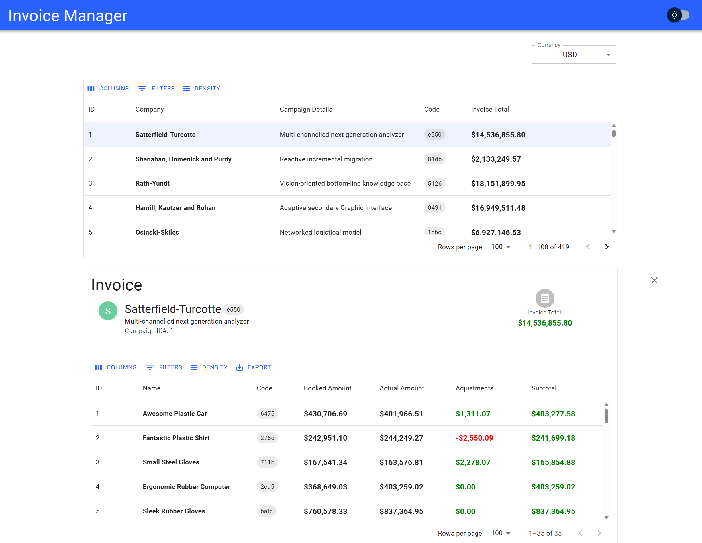

# Invoice Manager

[](https://github.com/prettier/prettier)

> &nbsp;
> This take-home project is called the **Invoice Manager**. This tool allows you to manage an example invoice JSON.
> &nbsp;



### <u>Features</u>

#### Bucket #1

- [x] The user should be able browse through the line-item data as either a
      list or table (ie. pagination or infinite-scrolling).
- [x] The user should be able to see each line-item's billable amount (sub-
      total = actuals + adjustments).
- [x] The user should be able to see sub-totals grouped by campaign (line-
      items grouped by their parent campaign).
- [x] The user should be able to see the invoice grand-total (sum of each
      line-item's billable amount).
- [x] The user should be able to sort the data.
  > <b>Thoughts/Why Chosen?</b>
  >
  > - A paginated List/Datagrid can almost be considered a necessity of most, if not all, enterprise applications as it is usually the most efficient way to view/manage large data sets.
  > - Given the assumed intention of the application (to view/manage a list of campaign invoices), being able to display both the billable amout of each line item and the subtotal for a given campaign was a critical feature for the application to be useful.
  > - I would add full CRUD for the campaigns/line items, as well as archiving, reviewing, and comments if given more time to implement those features as they would require a significant time investment for planning/infra setup/development, beyond what I can currently commit to for a take home project.

#### Bucket #2

- [x] An integration into an external service that makes sense (eg. a currency conversion service, an export to Amazon S3, etc)
- [x] The user should be able to filter the data (ie. by campaign name, etc.,
      should affect the grand-total).
  > <b>Thoughts/Why Chosen?</b>
  >
  > - I choose to integrate a currency conversion service ([openexchangerates.org](https://openexchangerates.org/)) because I believe it satisfied a valuable use case given that there invoices/totals are highly visible, and it easy to assume that a user would enjoy the convenience of being able to choose which currency monetary values are displayed in.
  > - I felt was also an incredibly necessary feature to implement due to the (potentially) very large data set. It's one of the very first things that a user may want to do.

### <u>Tools/Languages</u>

- **Dev Enviroment/Build Tool**
  - [NextJS](https://nextjs.org/)
- **UI Framework/Language**
  - [React](https://react.dev/) / [TypeScript](https://www.typescriptlang.org/)
- **Design System**
  - [Material UI (MUI)](https://mui.com/)
- **Unit Testing**
  - [Jest](https://jestjs.io/)

### <u>How To Run</u>

##### Requirements:

- `node` >= v14.21.3

##### Starting the App:

First, clone the repository locally, then run the following:

```shell
$ npm install # Install dependencies (required for every step hereafter)
$ npm run dev # Start the development server
```

##### Create Production Build:

```shell
$ npm run build # Required for preview task below
```

##### Preview Production Build:

```shell
$ npm run preview
```

##### Running Tests:

```shell
$ npm run unit-test
```

##### Running Linter:

```shell
$ npm run lint
```
